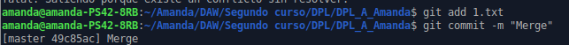

# DPL_A_Amanda

Crear una rama v0.2.: git branch v0.2

Posiciona tu carpeta de trabajo en esta rama.: git checkout v0.2

Añadir un fichero 2.txt en la rama v0.2: 
touch 2.txt
git add 2.txt
git commit -m "Creación fichero2"

Subir los cambios al repositorio remoto: git push --set-upstream origin v0.2

Posicionarse en la rama master: git checkout master

Hacer un merge de la rama v0.2 en la rama master: git merge v0.2

En la rama master poner Hola  en el fichero 1.txt y hacer commit: 
nano 1.txt
git add 1.txt
git commit -m "Mensaje Hola"
git push

Posicionarse en la rama v0.2 y poner Adios en el fichero 1.txt y hacer commit.:
git checkout v0.2
nano 1.txt
git add 1.txt
git commit -m "Mensaje Adiós"
git push

Posicionarse de nuevo en la rama master y hacer un merge con la rama v0.2:
git checkout master
git merge v0.2

Listar las ramas con merge y las ramas sin merge.: 
git branch --merged
git branch --no-merged

Arreglar el conflicto anterior y hacer un commit. Explicar como lo has arreglado incluyendo capturas de pantalla.
nano 1.txt
git add 1.txt
git commit -m "Merge"

El conflicto se ha solucionado editando las líneas que se solapaban en el archivo. Una vez arreglado, se crea el commit.

Crear un tag v0.2: git tag -a v0.2 -m "mi versión 0.2"
Borrar la rama v0.2: git branch -d v0.2

Listar los distintos commits con sus ramas y sus tags.: git log

Crea una organización llamada orgdpl-tunombredeusuariodegithub:

Crear dos equipos en la organización orgdpl-tunombredeusuariodegithub, uno llamado administradores con más permisos y otro colaboradores con menos permisos:

