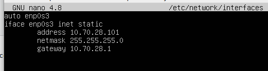

# DPL_A_Amanda

Para cada máquina, la configuración del adaptador red en el Virtualbox sería:

Se realiza la configuración IP en Windows 7:

Se configura el nombre del equipo y se añade a un grupo de trabajo que se llama DESPLIEGUEXX:

Se configura el adaptador de red en Ubuntu Server. Se averigua el nombre que el sistema ha asignado a nuestra interfaz, utilizando el comando ifconfig:

Se edita el fichero de configuración de las interfaces de red:

En Ubuntu ha sido necesario utilizar Netplan para configurar la red:

En Windows 7 ha sido necesario crear una regla en Firewall:

Comprobación de la configuración y de funcionamiento:

