# DPL_A_Amanda

Para instalar Apache, en primer lugar, actualizamos el índice de paquetes locales para que reflejen los últimos cambios anteriores:

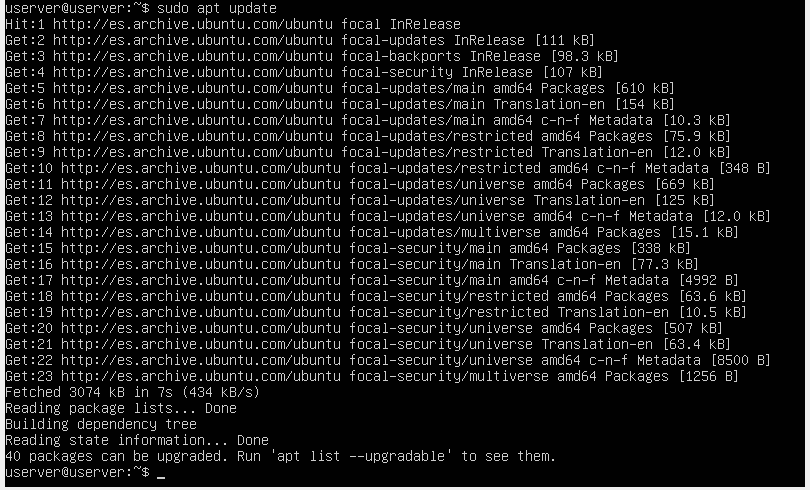

Instalamos Apache haciendo uso de "sudo apt install apache2":

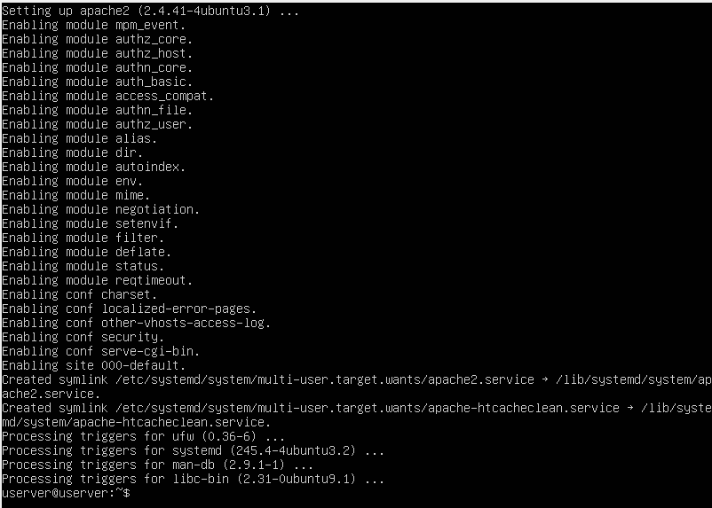

Antes de probar Apache, es necesario modificar los ajustes de firewall para permitir el acceso externo a los puertos web predeterminados.
Durante la instalación, Apache se registra con UFW para proporcionar algunos perfiles de aplicación que pueden utilizarse para habilitar 
o deshabilitar el acceso a Apache a través del firewall. Enumeramos los perfiles ufw y habilitamos el perfil Apache, que es el más restrictivo.
En esta ocasión, sólo vamos a permitir el tráfico en el puerto 80:

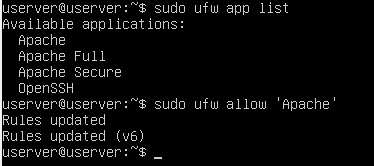

Verificamos el cambio. Obtenemos como respuesta que el firewall no está activo. Para solucionarlo, activamos el firewall.

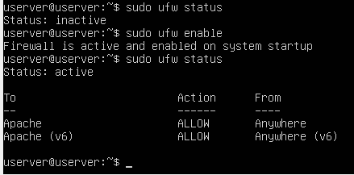

Realizamos una verificación con el sistema init systemd para saber si se encuentra en ejecución el servicio:

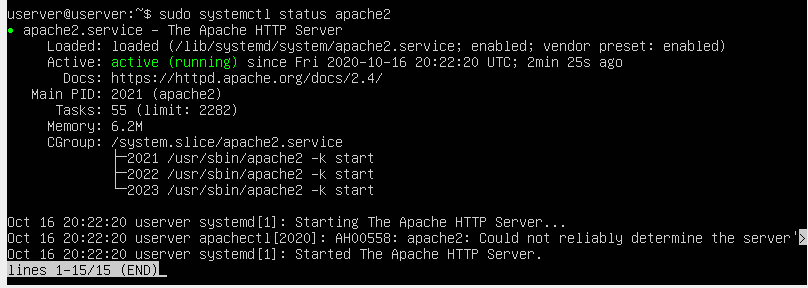

Otra forma de comprobar que el servidor web está funcionando, es solicitar una página de Apache. Es decir, 
podemos acceder a la página de destino predeterminada de Apache para confirmar que el software funcione correctamente mediante su dirección ip.

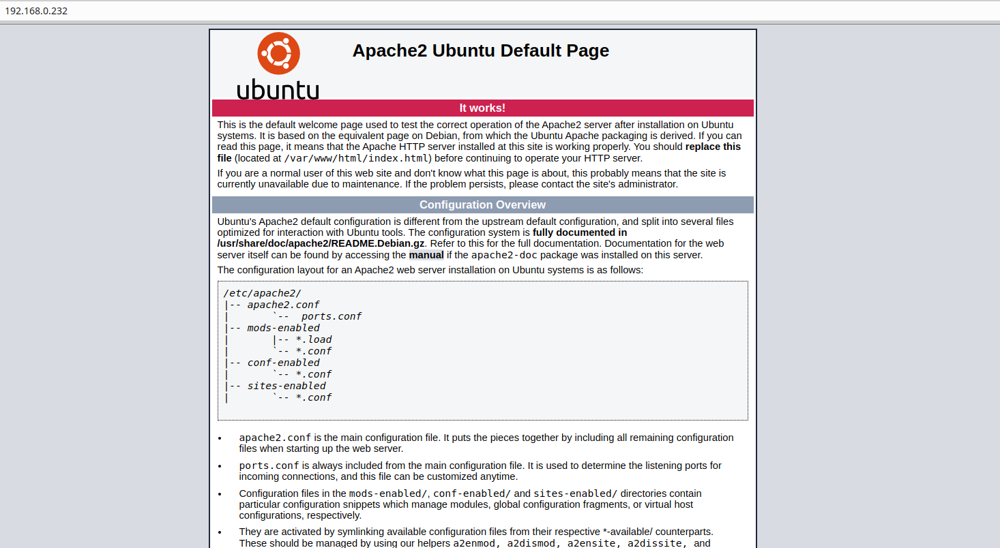

Detenemos el servidor web:

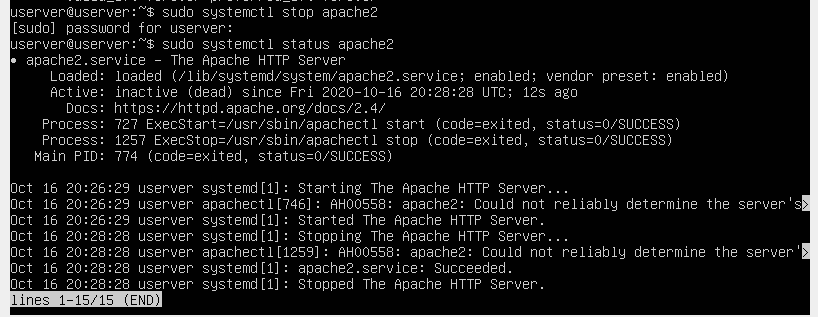

Iniciamos el servidor web cuando no está activo:

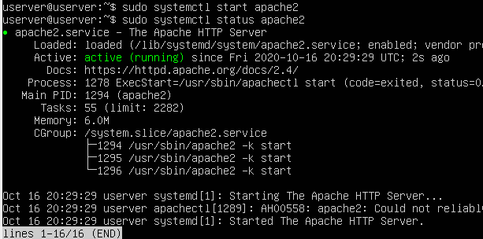

Detenemos y luego iniciamos el servicio de nuevo:

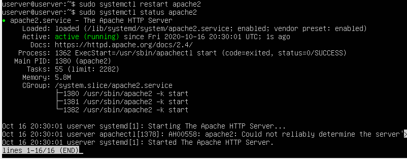

Si solo realiza cambios de configuración, Apache a menudo puede recargarse sin cerrar conexiones. Para hacerlo:

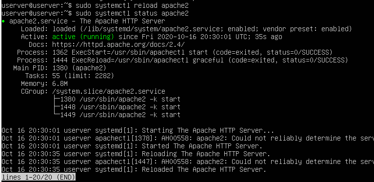

Por defecto, Apache está configurado para iniciarse automáticamente cuando el servidor (Ubuntu) lo hace. Si no es lo que se quiere, deshabilitamos este
comportamiento:

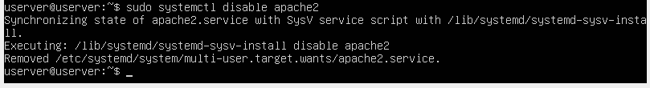

Para volver a habilitar el servicio de modo que se cargue en el inicio:

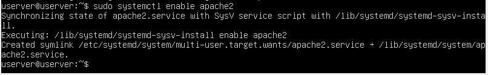

