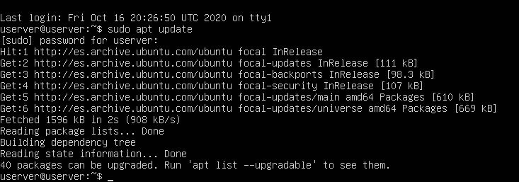
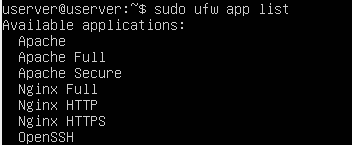
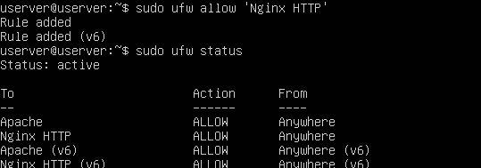
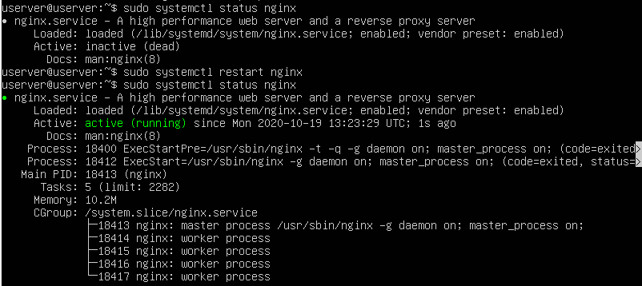
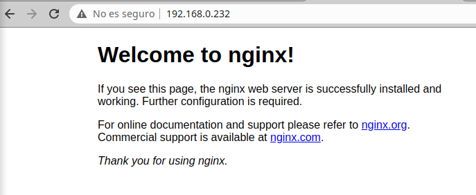
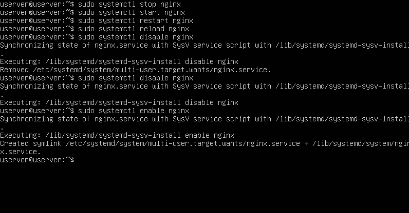

# DPL_A_Amanda

En primer lugar, actualizamos los paquetes:

Después, instalamos Nginx con "sudo apt install nginx" y enumeramos los perfiles de aplicación que pueden utilizarse para habilitar o deshabilitar el acceso a Nginx a través del firewall:

Se recomienda habilitar el perfil más restrictivo. En este momento, solo permitimos el tráfico en el puerto 80 y verificamos el cambio:

En este caso, el firewall está activo, así que verificamos si el servicio se encuentra en ejecución:

Otra forma de comprobar que el servidor web está funcionando es solicitar una página de Nginx, es decir, podemos acceder a la página de destino predeterminada de Nginx para confirmar que el software funcione correctamente mediante su dirección ip:

Práctica de los comandos básicos:

-Detenemos el servidor.
-Iniciamos el servidor cuando no está activo.
-Detenemos y reiniciamos el servidor de nuevo.
-Recargamos Nginx cerrando conexiones.
-Deshabilitamos que Nginx se inicie automáticamente cuando el servidor (Ubuntu) lo hace.
-Volvemos a habilitar el servicio para que se cargue en el inicio.

