# DPL_A_Amanda

En primer lugar, actualizamos los paquetes:

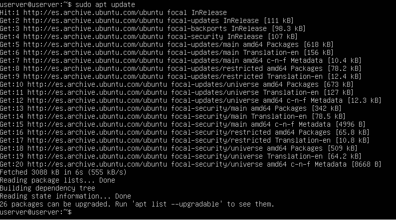

Después instalamos los paquetes principales, correspondientes al núcleo de Tomcat y a las aplicaciones administrativas:

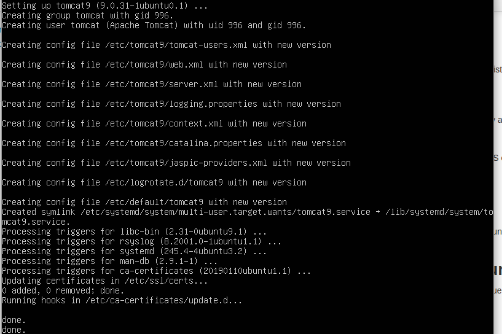

Tras la instalación de Tomcat y sus dependencias se crea en Ubuntu 20.04 LTS el servicio tomcat9.service que queda
 en ejecución y habilitado para arrancar automáticamente junto al sistema:

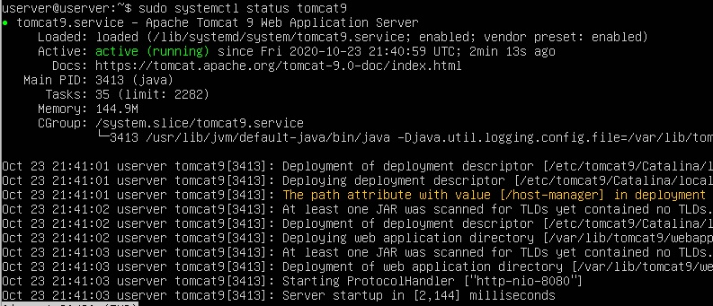

Si se accede a Tomcat 9 desde la red y se tiene activado este firewall en Ubuntu 20.04 LTS, habrá que añadir una regla:

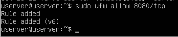

Podemos crear los usuarios que consideremos con contraseña y con uno o ambos roles, en este caso será un solo usuario con ambos roles: 

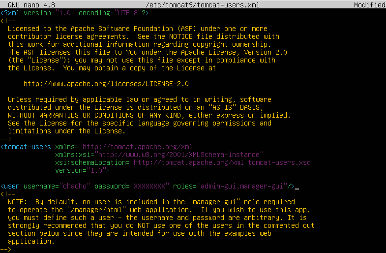

Algunas aplicaciones, de nuevo entre ellas las aplicaciones administrativas, restringen en su configuración personal el acceso desde red,
 por lo que debemos editar su archivo de configuración:

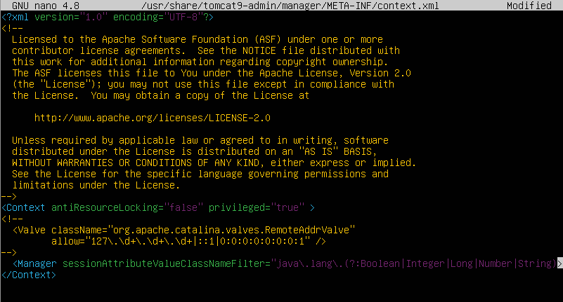

Para el Gestor de Máquina Virtual, o aplicación Host Manager, habría que hacer un cambio exactamente igual:

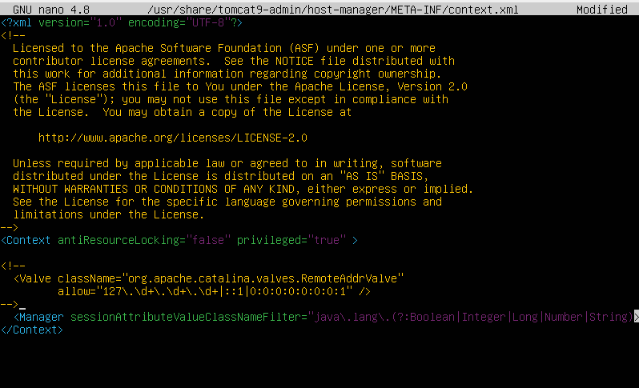

Vamos a acceder a Tomcat 9 en Ubuntu 20.04 LTS, desde un navegador, para lo que indicaremos la dirección IP o nombre de la máquina y el
puerto de conexión, que en la configuración estándar es el 8080:

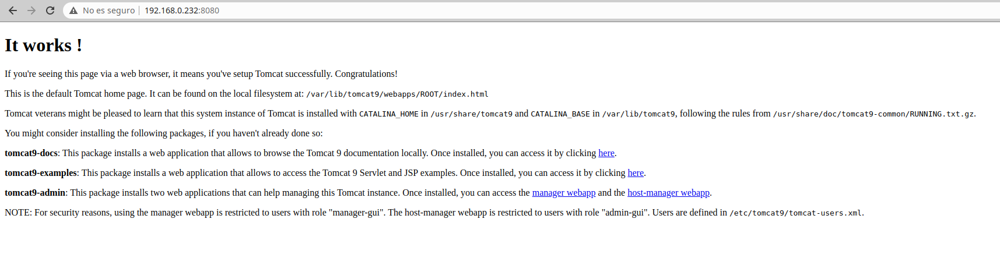

Mostramos el Gestor de Aplicaciones Web introduciendo el nombre y la contraseña del usuario que creamos con el rol manager-gui para poder acceder:

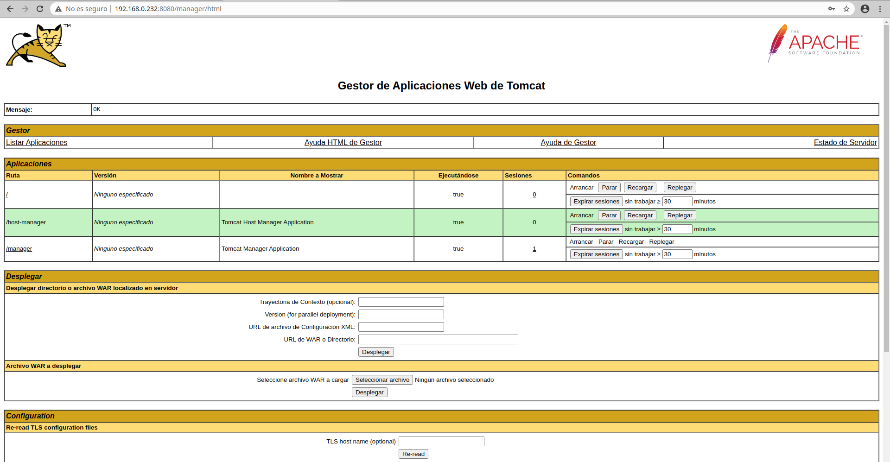

Accedemos al Gestor de Máquina Virtual de Tomcat:

Si se dispone de un arhivo .war correspondiente a una aplicación que se quiera desplegar en Tomcat 9 sobre Ubuntu,
hay que entrar en el Gestor de Aplicaciones Web de Tomcat y desplazarse hasta la sección Desplegar, concretamente al recuadro Archivo WAR a desplegar. Utilizando el
botón Seleccionar archivo se podrá buscar el archivo .war en el sistema de archivos.

Cuando el archivo esté seleccionado, se pulsa el botón Desplegar. La aplicación será desplegada y se recargará el Gestor de Aplicaciones, la nueva aplicación aparecerá
en la lista de aplicaciones, junto a sus controles de gestión:

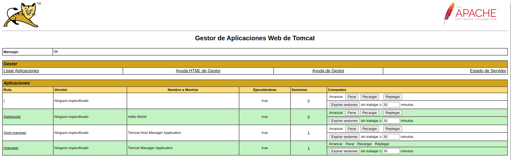

Para probar la nueva aplicación bastará con seguir el enlace que aparece en la misma lista de aplicaciones, que será el enlace que facilitaremos a nuestros usuarios:

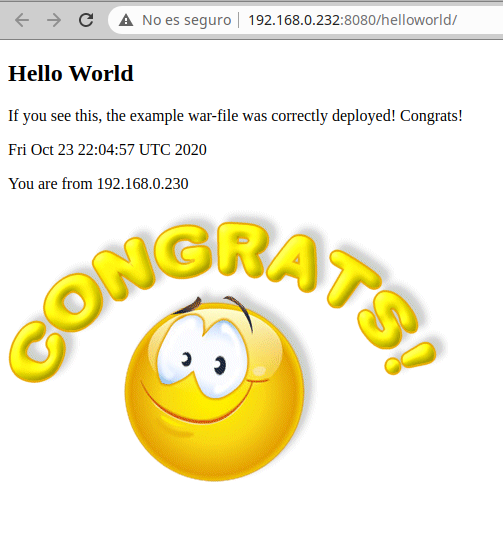

Es posible que para alguna aplicación en concreto no baste con el valor por defecto del tamaño máximo de archivos .war. Podremos aumentar este tamaño editando
 el archivo de configuración web.xml:

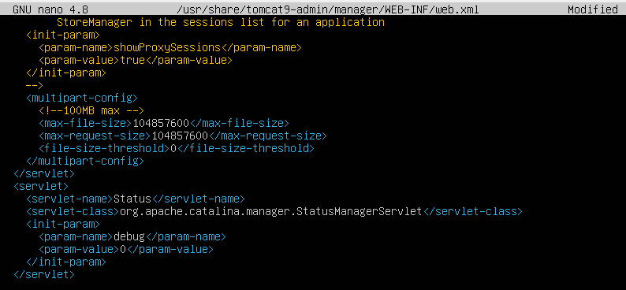

