# DPL_A_Amanda

En primer lugar, actualizamos el repositorio y paquetes con los comandos
sudo apt update
sudo apt upgrade

En este caso, teníamos instalado el servidor Apache previamente. En caso contrario, debemos instalarlo.
Instalamos el servidor de base de datos MaríaDB:

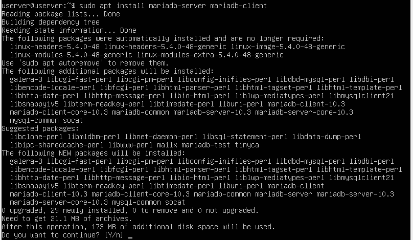

Después de que se instale, el servidor MariaDB debe ejecutarse automáticamente. Comprobamos el estado del
servidor:

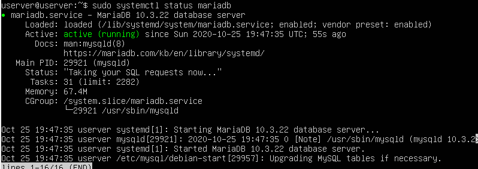

Para permitir que MariaDB se inicie automáticamente en el momento del arranque, debemos ejecutar "sudo systemctl enable mariadb".
Verificamos la versión del servidor mariadb instalado:

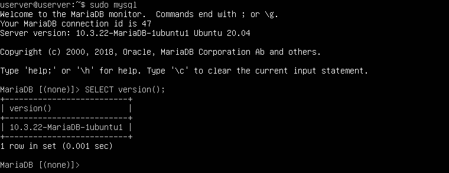

Ejecutamos un script de seguridad posterior a la instalación, por medio del comando "sudo mysql_secure_installation"
Cuando nos solicite que escribamos la contraseña root de MariaDB, pulsamos Intro, ya que la contraseña root aún no está configurada.
Después escribimos la contraseña de root para el servidor MariaDB.
A continuación, podemos pulsar Intro para responder todas las preguntas restantes. Esto eliminará el usuario anónimo, deshabilitará el
inicio de sesión raíz remoto y eliminará la base de datos de prueba:

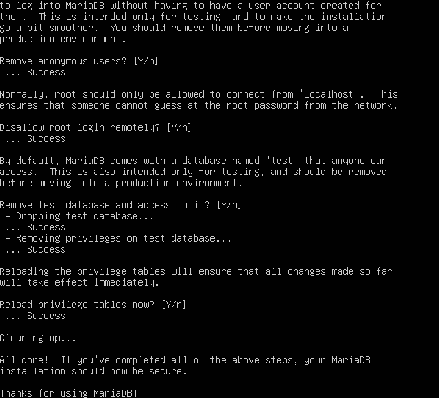

Pruebamos el acceso a la base de datos con la nueva contraseña:

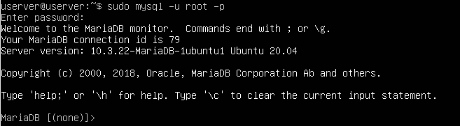

Creamos un nuevo usuario en la base de datos llamado developer con la contraseña 5t6y7u8i:

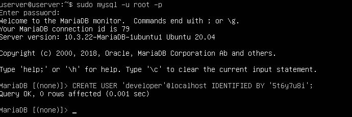

Accedemos a la base de datos con el nuevo usuario creado:

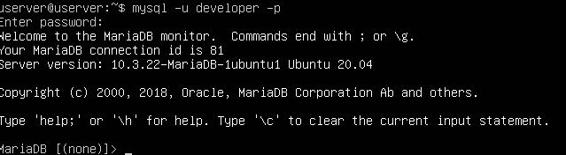

Instalamos PHP y algunos módulos PHP comunes. Ahora tendremos que activar el módulo Apache php8 y reiniciar el servidor web Apache:

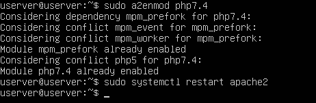

Verificamos la versión de PHP instalada:

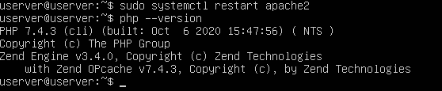

Para probar los scripts PHP con el servidor Apache, necesitamos crear un archivo info.php en el directorio raíz:
sudo vim /var/www/html/info.php

Dentro del archivo vamos a pegar el siguiente código PHP: <?php phpinfo(); ?>
Una vez guardado el archivo, ahora en la barra de direcciones del navegador tendremos que escribir dirección-ip/info.php:

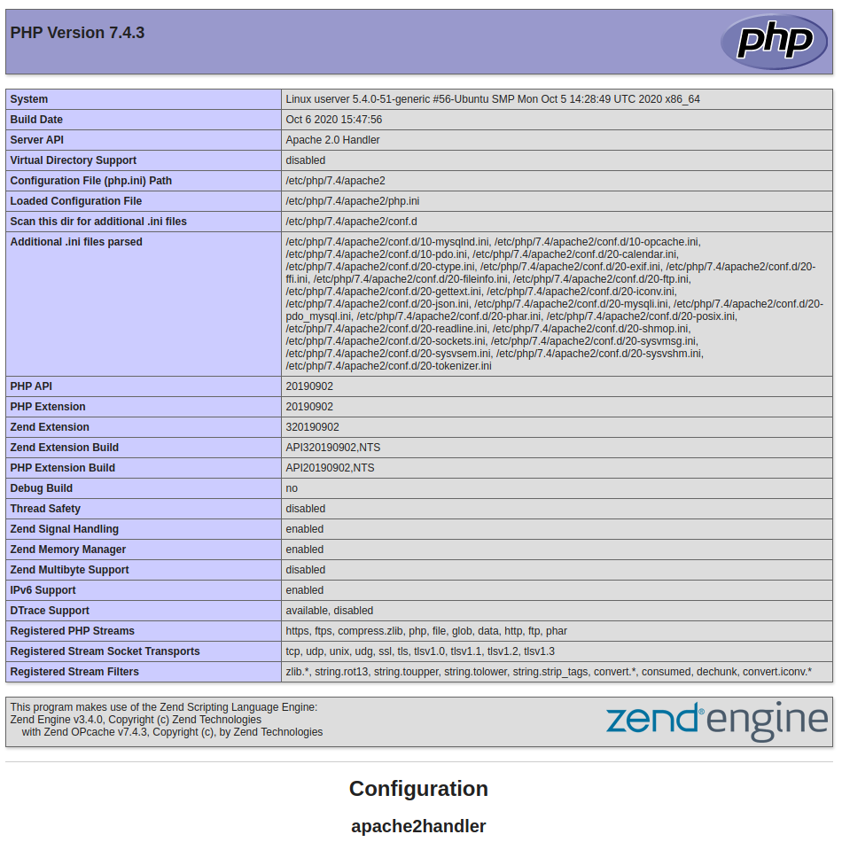

Tenemos dos formas de ejecutar código PHP con el servidor web Apache. Con el módulo PHP Apache y con PHP-FPM.7. En los pasos anteriores,
el módulo Apache PHP7.4 se usa para manejar el código PHP. Esto generalmente está bien, pero en algunos casos debemos ejecutar código PHP
con PHP-FPM. Para hacerlo, tendremos que deshabilitar el módulo Apache PHP8 con "sudo a2dismod php7.4".

Posteriormente instalamos PHP-FPM:
sudo apt install php7.4-fpm

Continuamos habilitando proxy_fcgi y el módulo setenvif:
sudo a2enmod proxy_fcgi setenvif

El siguiente paso será habilitar el archivo de configuración /etc/apache2/conf-available/php7.4-fpm.conf:
sudo a2enconf php7.4-fpm

Después debemos reiniciar Apache:
sudo systemctl restart apache2

Ahora, si actualizamos la página info.php en el navegador, encontraremos que la API del servidor ha cambiado de Apache 2.0 Handler a FPM/FastCGI, lo que 
significa que el servidor web Apache pasará las solicitudes de PHP a PHP-FPM:

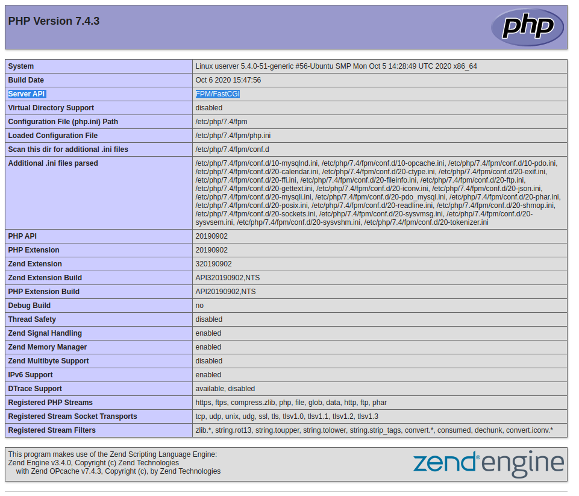

