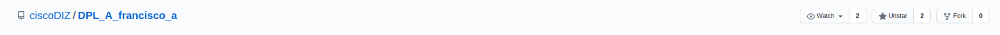

Clonar el repositorio en local: git clone https://github.com/Amandasanzlop/DPL_A_Amanda.git

Añadir fichero al commit: git add tarea1_1.md

Crear commit con mensaje: git commit -m "commit inicial"

Subir los cambios al repositorio remoto: git push

Crear en el repositorio local un fichero llamado privado.txt: touch privado.txt
Crear en el repositorio local una carpeta llamada privada: mkdir privada
Realizar los cambios oportunos para que tanto el archivo como la carpeta sean ignorados por git.: 
touch .gitignore
nano .gitignore
git add .gitignore 
git commit -m "Ignorar archivos"
git push

Añadir 1.txt al repositorio local:
touch 1.txt
git add 1.txt

Crear un tag v0.1: git tag -a v0.1 -m "mi versión 0.1"
Subir los cambios al repositorio remoto: git push origin v0.1

Poner una foto en el perfil de GitHub:

Poner el foble factor de autentificación en la cuenta de GitHub:

Seguir los repositorios de los compañeros:
Añadir una estrella a los repositorios de los compañeros:

Crear una tabla:

| NOMBRE  | GITHUB  |
|---|---|
| Alanis  | (https://github.com/alaniscrln/dpl_alanis)  |
| Estanis  | (https://github.com/dawestanis/dpl_B_estanis)  |
| Francisco | (https://github.com/ciscoDIZ/DPL_A_francisco_a)  |

